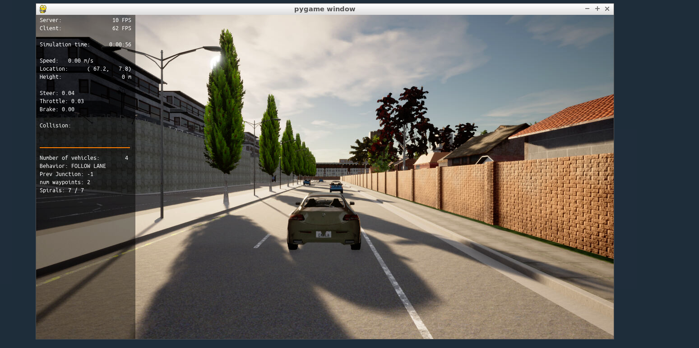
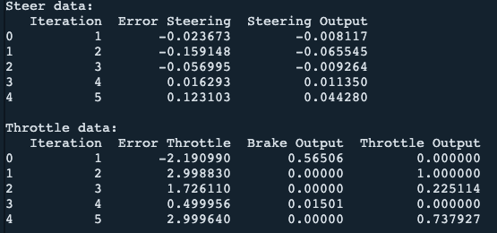

# Control and Trajectory Tracking for Autonomous Vehicle

# Proportional-Integral-Derivative (PID)

This project is a design and implementation a PID controller for steering and throttle to perform vehicle trajectory tracking. 
This PID controller is then used on CARLA Simulator to test and fine tune the PID constants values.

Screenshot of carla simulator.

### Installation

Run the following commands to install the starter code in the Udacity Workspace:

Clone the <a href="https://github.com/udacity/nd013-c6-control-starter/tree/master" target="_blank">repository</a>:

`git clone https://github.com/udacity/nd013-c6-control-starter.git`

## Run Carla Simulator

Open new window

* `su - student`
// Will say permission denied, ignore and continue
* `cd /opt/carla-simulator/`
* `SDL_VIDEODRIVER=offscreen ./CarlaUE4.sh -opengl`

## Compile and Run the Controller

Open new window

* `cd nd013-c6-control-starter/project`
* `./install-ubuntu.sh`
* `cd pid_controller/`
* `rm -rf rpclib`
* `git clone https://github.com/rpclib/rpclib.git`
* `cmake .`
* `make` (This last command compiles your c++ code, run it after every change in your code)

## Testing

To test your installation run the following commands.

* `cd nd013-c6-control-starter/project`
* `./run_main_pid.sh`
This will silently fail `ctrl + C` to stop
* `./run_main_pid.sh` (again)
Go to desktop mode to see CARLA

If error bind is already in use, or address already being used

* `ps -aux | grep carla`
* `kill id`

## Project Instructions

In the directory [/pid_controller](project/pid_controller)  you will find the files [pid.cpp](project/pid_controller/pid.cpp)  and [pid.h](project/pid_controller/pid.h). This is where I have code for my pid controller.
The function pid is called in [main.cpp](project/pid_controller/main.cpp).

In [/project/](project/) directory I have the plots of pid controller for steering and throttle. The is also one screenshot of the carla simulation.

Answer the following questions:
- Add the plots to your report and explain them (describe what you see)

Output of steering and throttle PID controller

PID controller decreases the error smoothly.

- What is the effect of the PID according to the plots, how each part of the PID affects the control command?

Proportional or P controller gives output proportional to the error to make the error 0, but it always has some offset.
I controller integrates the error over a period of time thereby eleminating the offset of p-controller.
D controller anticipates the future behavior od error.

- How would you design a way to automatically tune the PID parameters?
- 
By implementing twiddle algorithm or other hyper parameter tuning algorithms.

- PID controller is a model free controller, i.e. it does not use a model of the car. Could you explain the pros and cons of this type of controller?

Pros: Easy to design and optimize.
Cons: May not hold good if it is used of different sized vehicles without tuning the pid constants for that vehicle.

- (Optional) What would you do to improve the PID controller?

